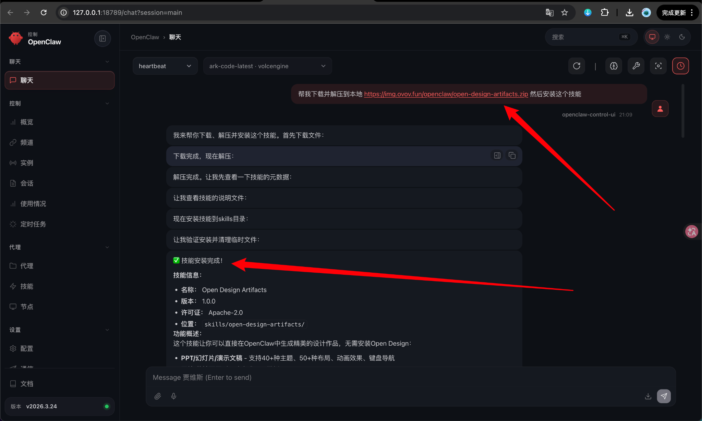
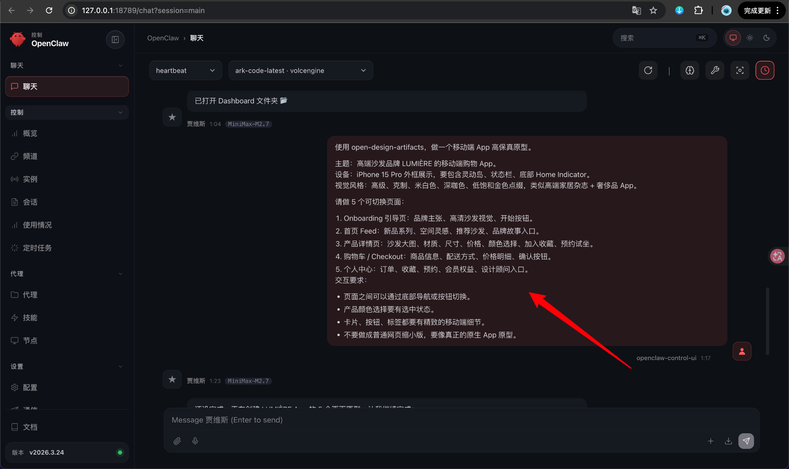
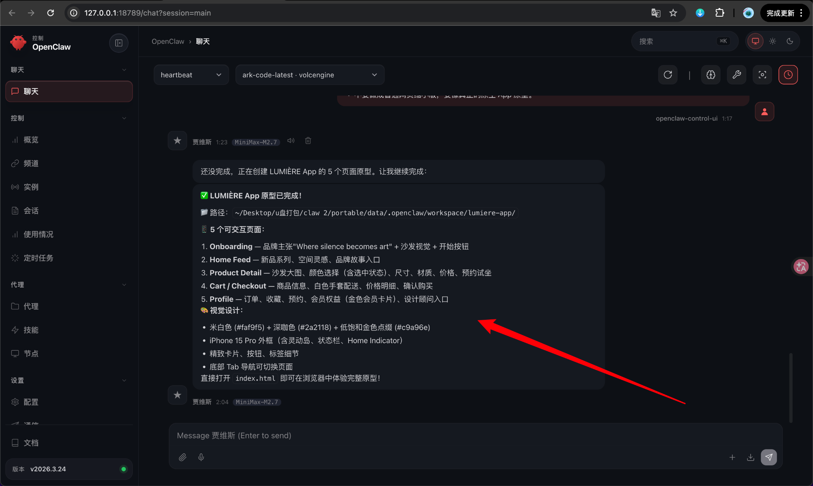
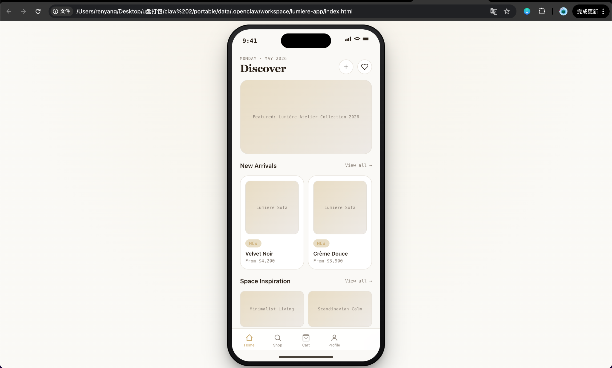

# OpenClaw 使用 open-design-artifacts 技能生成高保真移动端 App 原型

## 演示预览

<div class="demo-link-grid">
  <a href="/demos/lumiere-app/" target="_blank" rel="noopener">
    <span>演示网址</span>
    <strong>LUMIÈRE APP</strong>
    <em>高保真移动端测试网页</em>
  </a>
</div>

## 第 1 步：安装 open-design-artifacts 技能

在 OpenClaw 聊天框中输入：

```text
帮我下载并解压到本地 https://img.ovov.fun/openclaw/open-design-artifacts.zip 然后安装这个技能
```

发送后等待 OpenClaw 自动下载、解压和安装。



看到类似下面的信息，就说明安装成功：

```text
✅ 技能安装完成！
名称：Open Design Artifacts
版本：1.0.0
位置：skills/open-design-artifacts/
```

安装完成后，就可以在 OpenClaw 里直接调用 `open-design-artifacts` 来生成网页设计稿、App 原型和本地可预览的 HTML 项目。

---

## 第 2 步：输入移动端 App 原型需求

技能安装完成后，在 OpenClaw 聊天框中继续输入 App 设计需求。

这次我们要做的是一个移动端 App 高保真原型，所以提示词里要明确写出：设备外框、视觉风格、页面数量、交互方式，以及不要做成普通网页缩小版。

可以直接复制下面这段提示词：

```text
使用 open-design-artifacts，做一个移动端 App 高保真原型。

主题：高端沙发品牌 LUMIÈRE 的移动端购物 App。
设备：iPhone 15 Pro 外框展示，要包含灵动岛、状态栏、底部 Home Indicator。
视觉风格：高级、克制、米白色、深咖色、低饱和金色点缀，类似高端家居杂志 + 奢侈品 App。

请做 5 个可切换页面：

1. Onboarding 引导页：品牌主张、高端沙发视觉、开始按钮。
2. 首页 Feed：新品系列、空间感、推荐沙发、品牌故事入口。
3. 产品详情页：沙发大图、材质、尺寸、价格、颜色选择、加入收藏、预约试坐。
4. 购物车 / Checkout：商品信息、配送方式、价格明细、确认按钮。
5. 个人中心：订单、收藏、预约、会员权益、设计顾问入口。

交互要求：

• 页面之间可以通过底部导航或按钮切换。
• 产品颜色选择要有选中状态。
• 卡片、按钮、标签都要有精致的移动端细节。
• 不要做成普通网页缩小版，要像真正的原生 App 原型。
```



这段提示词里有几个关键点：

- **主题明确**：告诉 OpenClaw 这是高端沙发品牌 LUMIÈRE 的购物 App。
- **设备明确**：要求展示 iPhone 15 Pro 外框，并包含灵动岛、状态栏和 Home Indicator。
- **风格明确**：米白色、深咖色、低饱和金色，这些词可以让视觉更统一。
- **页面明确**：一次性要求生成 5 个可切换页面。
- **交互明确**：底部导航、按钮切换、颜色选中状态都写清楚。

这样生成出来的结果会更接近真实 App 原型，而不是简单的网页排版。

---

## 第 3 步：等待 OpenClaw 自动创建项目

发送提示词后，OpenClaw 会开始调用技能生成原型文件。

如果中途看到类似“还没完成，正在创建 LUMIÈRE App 的 5 个页面原型”这样的回复，说明它正在继续处理，不需要手动中断。

生成完成后，会看到类似下面的信息：

```text
✅ LUMIÈRE App 原型已完成！

路径：~/Desktop/u盘打包/claw 2/portable/data/.openclaw/workspace/lumiere-app/

5 个可交互页面：

1. Onboarding — 品牌主张 + 沙发视觉 + 开始按钮
2. Home Feed — 新品系列、空间灵感、品牌故事入口
3. Product Detail — 沙发大图、颜色选择、尺寸、材质、价格、预约试坐
4. Cart / Checkout — 商品信息、配送方式、价格明细、确认购买
5. Profile — 订单、收藏、预约、会员权益、设计顾问入口

直接打开 index.html 即可在浏览器中体验完整原型！
```



这一步最重要的是记住生成路径。OpenClaw 会把项目创建在本地工作区中，通常里面会包含：

```text
lumiere-app/
├── index.html
├── style.css
└── script.js
```

有些情况下，所有代码也可能直接写在一个 `index.html` 文件里。只要能打开预览，就说明生成成功。

---

## 第 4 步：打开 index.html 预览 App 原型

进入 OpenClaw 提示的项目目录，找到 `index.html` 文件。

双击打开，或者把它拖到浏览器里，就可以看到生成好的移动端 App 原型。



示例效果中可以看到：

- 页面使用了 iPhone 15 Pro 手机外框。
- 顶部有状态栏和灵动岛。
- 页面主体是米白色和浅咖色的高级家居风格。
- 卡片、按钮、标签都更接近移动端 App 组件。
- 底部有 Tab 导航，可以切换不同页面。
- 底部保留了 Home Indicator，整体更像原生 App 原型。

这个结果已经不是普通网页，而是一个可以直接展示给客户或放进作品集里的移动端高保真原型。

---
