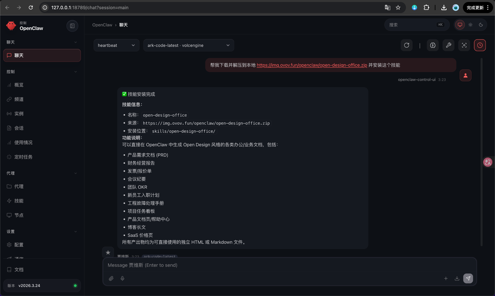
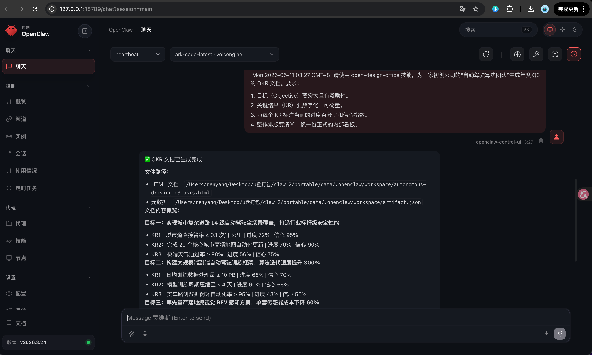
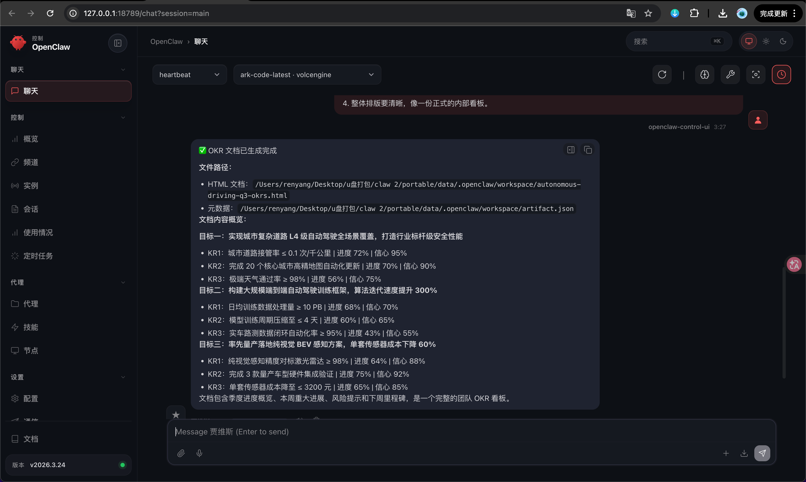
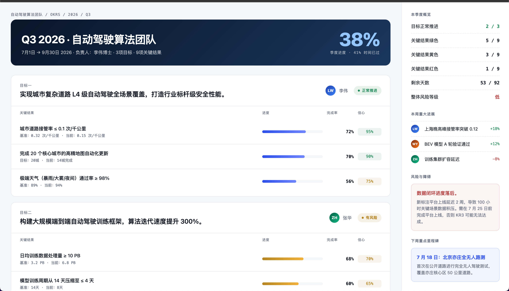

这篇教程演示如何在 OpenClaw 里安装并使用 `open-design-office`，快速生成可以直接打开的办公业务文档。

`open-design-office` 更适合生成工作场景里的文档页面，例如 PRD、财务经营报告、会议纪要、团队 OKR、工程故障处理手册、项目任务看板、产品文档页、SaaS 价格页等。

本次示例会做一个页面：

1. 自动驾驶算法团队 Q3 2026 OKR 看板：包含季度目标、关键结果、进度、信心值、风险障碍和下周里程碑。

## 案例预览

<div class="demo-link-grid">
  <a href="/demos/autonomous-okrs" target="_blank" rel="noopener">
    <span>演示网址</span>
    <strong>自动驾驶算法团队 Q3 OKR 看板</strong>
    <em>Open Design 风格办公文档</em>
  </a>
</div>

---

## 第 1 步：安装 open-design-office 技能

在 OpenClaw 聊天框中输入：

```text
帮我下载并解压到本地 https://img.ovov.fun/openclaw/open-design-office.zip 并安装这个技能
```

发送后等待 OpenClaw 自动下载、解压和安装。



看到类似下面的信息，就说明安装成功：

```text
✅ 技能安装完成

技能信息：
• 名称：open-design-office
• 来源：https://img.ovov.fun/openclaw/open-design-office.zip
• 安装位置：skills/open-design-office/
```

安装完成后，就可以在 OpenClaw 里直接调用 `open-design-office` 来生成办公文档。

---

## 第 2 步：输入 OKR 文档生成提示词

这次我们用一个自动驾驶团队的 OKR 看板作为案例。

在聊天框中输入：

```text
请使用 open-design-office 技能，为一家初创公司的“自动驾驶算法团队”生成年度 Q3 的 OKR 文档。要求：

1.目标（Objective）要宏大且有激励性。
2.关键结果（KR）要数字化、可衡量。
3.为每个 KR 标注当前的进度百分比和信心指数。
4.整体排版要清晰，像一份正式的内部看板。
```

这个提示词的重点是把「文档类型」「主题」「内容结构」「视觉风格」「输出格式」都说清楚。



---

## 第 3 步：等待 OpenClaw 生成文档

发送提示词后，OpenClaw 会调用 `open-design-office`，生成完整的 OKR 文档页面。

生成完成后，会返回 HTML 文件路径和文档内容概览。



本次案例里，OpenClaw 生成的 OKR 看板包含：

```text
目标一：实现城市复杂道路 L4 级自动驾驶全场景覆盖，打造行业标杆级安全性能
目标二：构建大规模端到端自动驾驶训练框架，算法迭代速度提升 300%
目标三：率先量产落地纯视觉 BEV 感知方案，单套传感器成本下降 60%
```

每个目标下面都有对应的关键结果、进度条、完成率和信心值。

---

## 第 4 步：打开 HTML 查看案例效果

生成完成后，直接打开 OpenClaw 返回的 HTML 文件，就可以看到最终的办公文档页面。



这个 OKR 看板主要由两部分组成：

1. 左侧主内容：展示 3 个 Objective，以及每个 Objective 下面的 3 个 Key Results。
2. 右侧信息栏：展示季度概览、本周重大进展、风险与障碍、下周重点里程碑。

这种格式很适合用来做团队周会、季度复盘、项目管理汇报，也可以直接作为内部文档页面使用。

---

## 第 5 步：复用这个提示词生成其他办公文档

`open-design-office` 不只适合生成 OKR，也可以生成其他办公业务文档。

你可以把提示词改成下面这些方向：

```text
使用 open-design-office，生成一份 SaaS 产品价格页，包含基础版、专业版、企业版三档套餐。
```

```text
使用 open-design-office，生成一份新员工入职计划，包含入职前准备、第 1 天、第 1 周、第 1 个月安排。
```

```text
使用 open-design-office，生成一份工程故障处理手册，包含故障分级、排查流程、回滚方案和复盘模板。
```

```text
使用 open-design-office，生成一份项目任务看板，包含需求池、进行中、待验收、已完成四个状态。
```

写提示词时，建议固定使用这个结构：

```text
使用 open-design-office，生成一个【文档类型】。

主题：【你的主题】
使用场景：【在哪里使用】
内容结构：【希望包含哪些模块】
视觉风格：【清爽 / 专业 / 高级 / 科技感 / 商务风】
输出格式：【HTML / Markdown】
```

---

## 小结

这篇教程完成了 3 件事：

1. 安装 `open-design-office` 技能。
2. 使用提示词生成自动驾驶算法团队 Q3 OKR 看板。
3. 打开生成的 HTML，查看完整办公文档案例。

如果你经常需要写 PRD、OKR、报告、会议纪要、任务看板这类办公文档，`open-design-office` 可以直接把普通文字需求变成可预览、可交付的设计化文档页面。
