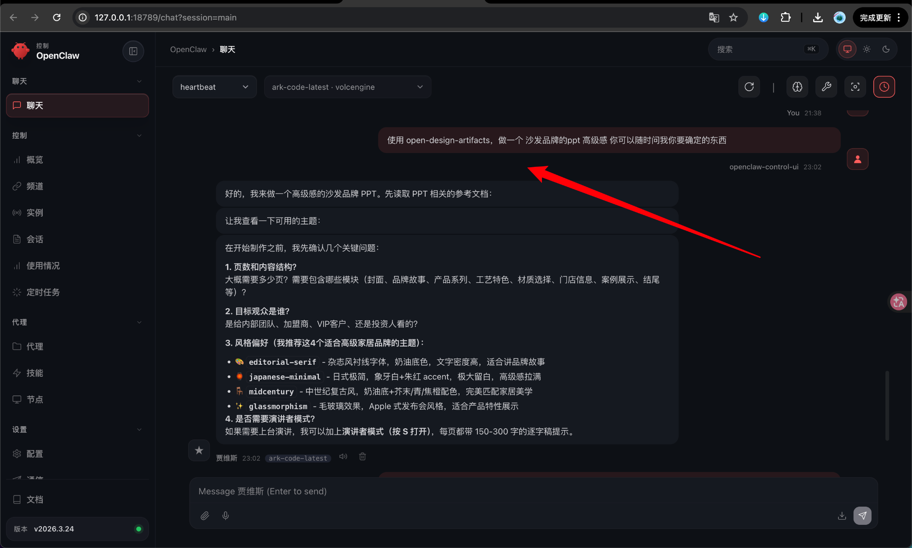
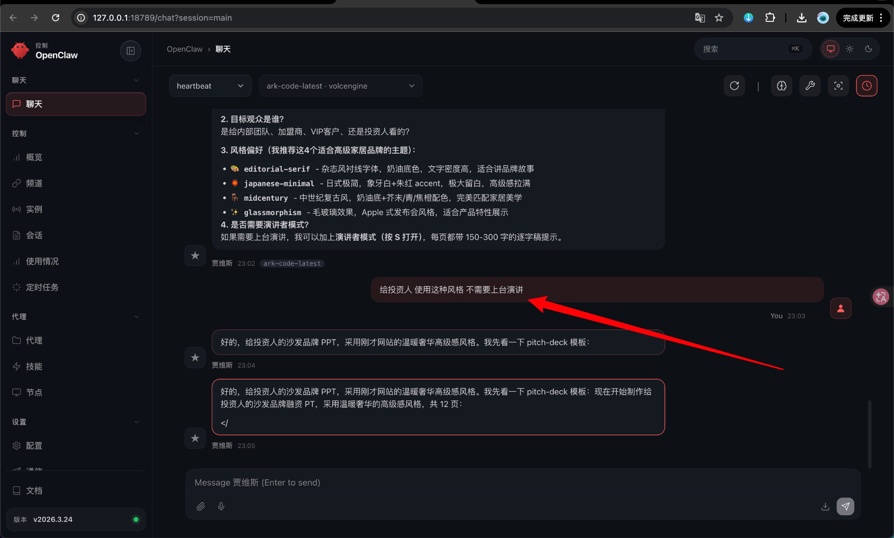
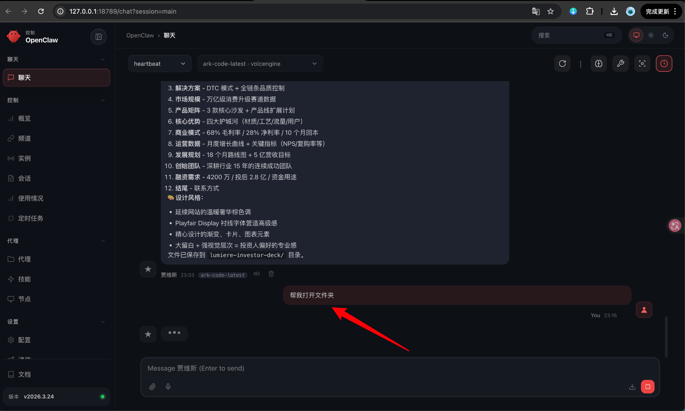
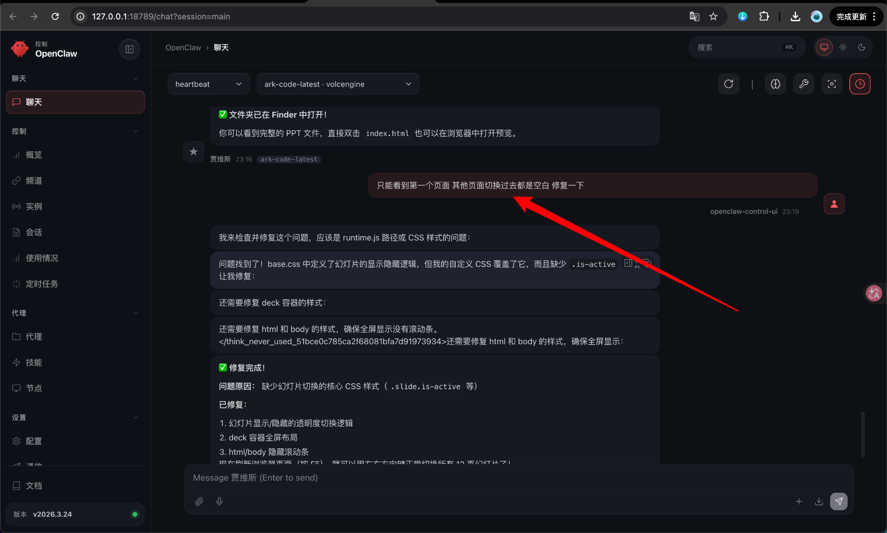

# OpenClaw 使用 open-design-artifacts 技能生成 PPT 图文教程

## 演示预览

<div class="demo-link-grid">
  <a href="/demos/lumiere-investor-deck/" target="_blank" rel="noopener">
    <span>演示网址</span>
    <strong>LUMIÈRE 投资人 Pitch Deck</strong>
    <em>沙发品牌高级路演 PPT</em>
  </a>
</div>

## 教程目标

本教程演示如何在 OpenClaw 中安装 `open-design-artifacts` 技能，并使用它生成一个高级感 PPT。示例主题是“沙发品牌 PPT”，你也可以替换成任何主题，例如课程汇报、商业计划书、产品介绍、品牌方案等。

---

## 第 1 步：安装 open-design-artifacts 技能

在 OpenClaw 聊天框中输入：

```text
帮我下载并解压到本地 https://img.ovov.fun/openclaw/open-design-artifacts.zip 然后安装这个技能
```

发送后等待 OpenClaw 自动下载、解压和安装。


看到类似下面的信息，就说明安装成功：

```text
✅ 技能安装完成！
名称：Open Design Artifacts
版本：1.0.0
位置：skills/open-design-artifacts/
```

---

## 第 2 步：使用技能生成 PPT

安装成功后，可以直接让它使用这个技能生成 PPT。

示例指令：

```text
使用 open-design-artifacts，做一个沙发品牌的 PPT，高级感。你可以随时问我需要确定的东西。
```



OpenClaw 可能会先询问几个关键信息，例如：页数、目标观众、风格偏好、是否需要演讲稿等。

---

## 第 3 步：补充目标观众和使用场景

如果你要做给投资人看的 PPT，可以补充：

```text
给投资人使用这种风格，不需要上台演讲。
```



这样生成的 PPT 会更偏向商业计划书、融资路演、品牌故事、市场规模、商业模式等内容。

---

## 第 4 步：等待生成并打开文件夹

当 OpenClaw 生成完成后，可以输入：

```text
帮我打开文件夹。
```



一般会生成一个文件夹，里面会有 `index.html` 或其他网页文件。双击 `index.html` 就可以在浏览器中预览 PPT。

---

## 第 5 步：如果 PPT 只显示第一页，要求它修复

如果打开后只能看到第一页，切换其他页面是空白，可以直接让 OpenClaw 修复：

```text
只能看到第一个页面，其他页面切换过去都是空白，修复一下。
```



它通常会检查 CSS、JS、幻灯片切换逻辑，然后修复页面显示问题。

---

## 常用提示词模板

### 模板 1：通用 PPT

```text
使用 open-design-artifacts，做一个【主题】PPT。
风格：【高级感 / 科技感 / 极简 / 商务 / 国风】。
目标观众：【投资人 / 客户 / 学生 / 内部团队】。
用途：【路演 / 汇报 / 品牌介绍 / 课程展示】。
不需要上台演讲，页面本身要信息完整、视觉高级。
你可以先问我需要确定的信息。
```

### 模板 2：投资人 Pitch Deck

```text
使用 open-design-artifacts，做一个【品牌/项目名】的投资人 Pitch Deck。
风格要高级、克制、像商业融资路演文档。
需要包含：项目简介、行业痛点、解决方案、产品矩阵、市场规模、商业模式、竞争优势、增长数据、发展规划、融资需求、团队介绍、联系方式。
不需要上台演讲，页面内容要让投资人直接看懂。
```

### 模板 3：品牌介绍 PPT

```text
使用 open-design-artifacts，做一个【品牌名】品牌介绍 PPT。
品牌定位是【填写定位】，目标用户是【填写用户】。
风格参考：【极简高级 / 奢华 / 年轻潮流 / 科技未来感】。
页面要有品牌故事、产品系列、核心卖点、视觉风格、用户场景、案例展示和结尾页。
```

---

## 常见问题

### 1. 安装后不知道怎么调用技能

直接在提示词里写：

```text
使用 open-design-artifacts，帮我做一个……
```

### 2. 生成后打不开

可以让 OpenClaw：

```text
帮我打开生成文件夹，并告诉我应该打开哪个文件。
```

### 3. 页面排版不满意

可以继续追问：

```text
整体太普通了，帮我改成更高级、更像投资人路演 PPT 的风格。
```

### 4. 想换颜色或风格

```text
把整体风格改成黑金高端风，标题更大，页面留白更多。
```

### 5. 想生成多个版本

```text
基于这个主题，帮我再生成 3 个不同视觉方向的版本：极简高级、科技感、奢华品牌风。
```

---

## 推荐工作流

1. 先安装技能。
2. 输入主题和用途。
3. 让 OpenClaw 先问你关键信息。
4. 补充目标观众、风格、页数和是否需要演讲。
5. 生成 PPT。
6. 打开文件夹预览。
7. 如果有显示或排版问题，继续让它修复。
8. 最后让它优化字体、配色、版式和文案。
