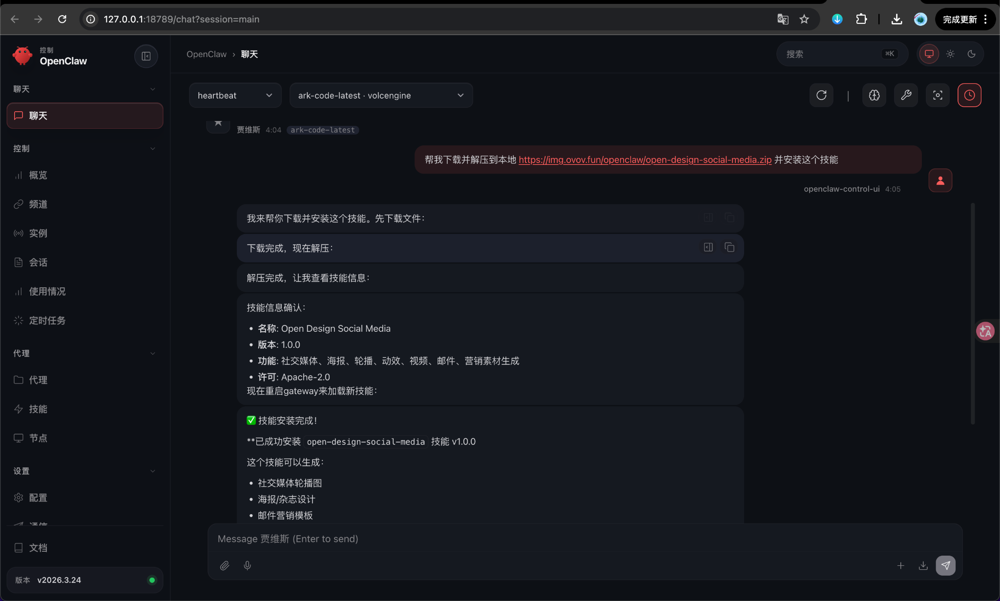
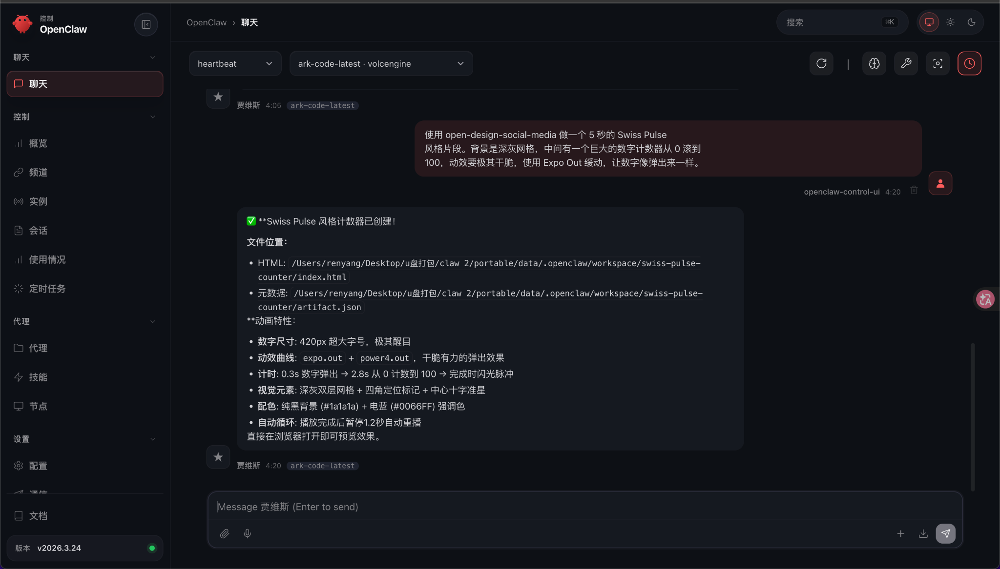
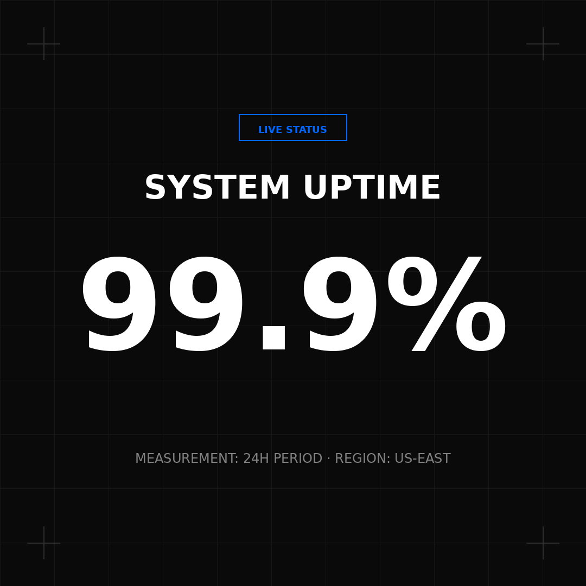

这篇教程演示如何在 OpenClaw 里安装并使用 `open-design-social-media`，快速生成适合社交媒体、海报、动效短片和营销素材的设计文件。

`open-design-social-media` 更适合生成偏视觉传播类的内容，例如社交媒体轮播图、海报、杂志风封面、动态视频片段、邮件营销模板、活动宣传图等。

本次示例会做一个页面：

1. Swiss Pulse 风格数字计数器：深灰网格背景，中间是一个从 0 滚动到 100 的巨型数字，动效干脆、适合做社交媒体短片或数据视觉片头。

## 案例预览

<div class="demo-link-grid">
  <a href="/demos/swiss-pulse-counter/" target="_blank" rel="noopener">
    <span>演示网址</span>
    <strong>Swiss Pulse 数字计数器</strong>
    <em>5 秒社媒动效片段</em>
  </a>
  <a href="/demos/swiss-pulse-counter/xiaohongshu-citywalk.html" target="_blank" rel="noopener">
    <span>演示网址</span>
    <strong>夏日 City Walk 指南</strong>
    <em>躲进魔都老洋房的夏天</em>
  </a>
</div>

---

## 第 1 步：安装 open-design-social-media 技能

在 OpenClaw 聊天框中输入：

```text
帮我下载并解压到本地 https://img.ovov.fun/openclaw/open-design-social-media.zip 并安装这个技能
```

发送后等待 OpenClaw 自动下载、解压和安装。



看到类似下面的信息，就说明安装成功：

```text
✅ 技能安装完成！

已成功安装 open-design-social-media 技能 v1.0.0

这个技能可以生成：
• 社交媒体轮播图
• 海报 / 杂志设计
• 邮件营销模板
• 动效片段
• 视频视觉素材
• 营销素材页面
```

安装完成后，就可以在 OpenClaw 里直接调用 `open-design-social-media` 来生成社媒视觉和动效素材。

---

## 第 2 步：输入 Swiss Pulse 动效提示词

这次我们用一个极简、有冲击力的数字计数器作为案例。

在聊天框中输入：

```text
使用 open-design-social-media 做一个 5 秒的 Swiss Pulse 风格片段。
背景是深灰网格，中间有一个巨大的数字计数器从 0 滚到 100，动效要极其干脆，使用 Expo Out 缓动，让数字像弹出来一样。
```

这个提示词的重点是把「素材类型」「视觉风格」「画面结构」「动效方式」都说清楚。

其中比较关键的是这几项：

- **素材类型**：5 秒社媒动效片段
- **视觉风格**：Swiss Pulse 风格、深灰网格、极简数据视觉
- **核心元素**：巨大数字计数器
- **动画方式**：从 0 滚动到 100，使用 Expo Out 缓动
- **观感要求**：数字像弹出来一样，干脆、有冲击力



---

## 第 3 步：等待 OpenClaw 生成动效页面

发送提示词后，OpenClaw 会调用 `open-design-social-media`，生成一个可以直接打开的 HTML 动效页面。

生成完成后，会返回 HTML 文件路径和元数据路径。

本次案例里，OpenClaw 生成的是一个 `swiss-pulse-counter` 项目，包含：

```text
HTML：swiss-pulse-counter/index.html
元数据：swiss-pulse-counter/artifact.json
```

生成结果里的动效特征包括：

```text
• 数字尺寸很大，适合作为视觉中心
• 使用 Expo Out / Power Out 这类干脆的缓动曲线
• 数字从 0 逐步滚动到接近 100
• 背景使用深色网格，强化 Swiss / Data Visual 风格
• 页面可以直接在浏览器中打开预览
```

---

## 第 4 步：打开 HTML 查看案例效果

生成完成后，直接打开 OpenClaw 返回的 HTML 文件，就可以看到最终的动效页面。



这个案例页面主要由 4 个部分组成：

1. **深色网格背景**：让画面更像数据可视化或科技品牌短片。
2. **状态标签**：顶部显示 `Live Status`，强化实时数据感。
3. **巨型数字**：中间的数字是画面核心，从 0 滚动到接近 100。
4. **底部说明文字**：用于补充数据周期、区域、指标说明等信息。

这种格式很适合用来做社交媒体短视频开头、产品发布数据展示、活动倒计时、运营数据战报、科技品牌视觉片段等。

---

## 第 5 步：复用这个提示词生成其他社媒素材

`open-design-social-media` 不只适合生成数字计数器，也可以生成其他传播类视觉素材。

你可以把提示词改成下面这些方向：

```text
使用 open-design-social-media，生成一个 1080x1080 的新品发布海报，风格为黑金高级感，中心展示产品名称和一句发布口号。
```

```text
使用 open-design-social-media，生成一组 5 页社交媒体轮播图，主题是 AI 工具使用技巧，要求每一页都有标题、要点和统一视觉风格。
```

```text
使用 open-design-social-media，生成一个 6 秒的倒计时动效，背景是深色科技感，数字从 5 倒数到 1，最后显示 Launch Now。
```

```text
使用 open-design-social-media，生成一个邮件营销模板，主题是 SaaS 产品限时优惠，包含头图、卖点、价格和 CTA 按钮。
```

写提示词时，建议固定使用这个结构：

```text
使用 open-design-social-media，生成一个【素材类型】。

主题：【你的主题】
尺寸 / 时长：【例如 1080x1080 / 5 秒】
画面结构：【希望出现哪些元素】
视觉风格：【Swiss / 高级 / 科技感 / 黑金 / 极简 / 品牌感】
动效要求：【如果是动效，说明进入、计数、切换、循环方式】
输出格式：【HTML / 图片 / 动效页面】
```

---

## 小结

这篇教程完成了 3 件事：

1. 安装 `open-design-social-media` 技能。
2. 使用提示词生成 Swiss Pulse 风格数字计数器。
3. 打开生成的 HTML，查看完整社媒动效案例。

如果你经常需要制作社交媒体轮播、海报、营销页、短视频视觉片段或活动素材，`open-design-social-media` 可以把普通文字需求快速转换成可以预览和交付的设计化页面。
