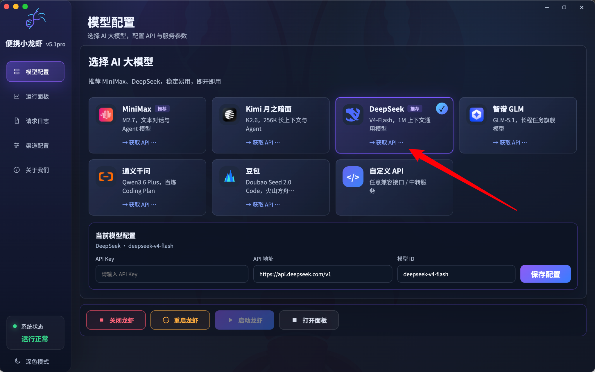
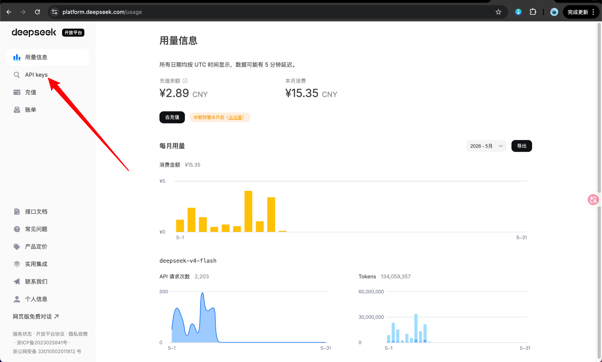
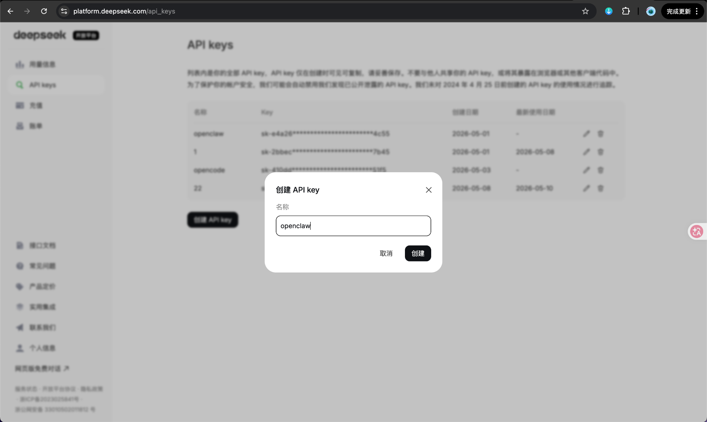
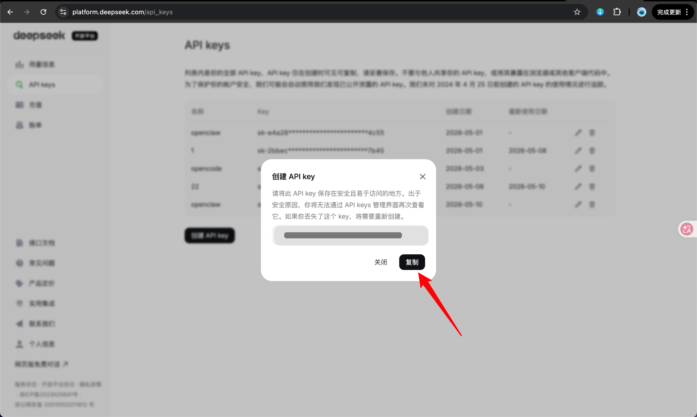
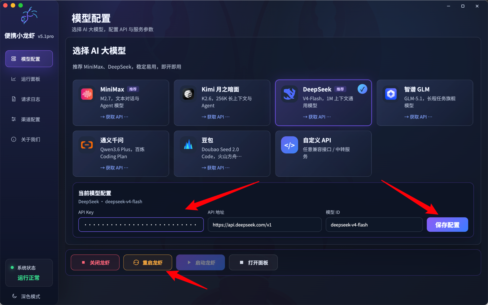

> 适用对象：第一次给 **OpenClaw / 便携小龙虾** 配置大模型的用户。  
> 本教程按照你提供的截图箭头，一步一步演示 **选择模型 → 申请 API Key → 填入配置 → 保存并重启** 的完整流程。

---

## 一、先了解这套流程要做什么

OpenClaw 本身并不直接提供模型能力，它需要你接入一个外部大模型服务。  
从这组截图来看，你当前使用的是 **DeepSeek** 作为模型提供方，因此完整流程就是：

1. 在 OpenClaw 客户端里选择 **DeepSeek**。
2. 进入 DeepSeek 开放平台，创建 **API Key**。
3. 把 API Key 填回 OpenClaw。
4. 保存配置并重启服务。
5. 启动后再进入面板验证是否能正常调用。

---

## 二、准备工作

开始前，先确认你已经准备好以下内容：

- 已安装并可以打开 **OpenClaw / 便携小龙虾**。
- 已注册并登录 **DeepSeek 开放平台**。
- DeepSeek 账户中有可用余额或可正常调用 API 的权限。
- 知道自己要使用的模型名称（本教程按截图使用 `deepseek-v4-flash`）。

> **提示**：如果以后你想接入 MiniMax、Kimi、GLM、豆包或自定义 API，配置思路也是一样的：
> 选择模型 → 获取该平台的 API Key → 填写 API 地址和模型 ID → 保存并重启。

---

## 三、详细配置步骤

## 步骤 1：在 OpenClaw 中选择模型，并进入“获取 API”



**看箭头操作：**

- 在“选择 AI 大模型”区域中，选中 **DeepSeek** 卡片。
- 点击卡片中的 **“获取 API…”** 链接。

### 这一步你会看到什么？

在下方“当前模型配置”区域，会出现当前选中的模型信息：

- **API Key**：这里后面要粘贴你从 DeepSeek 平台生成的密钥。
- **API 地址**：截图中默认是 `https://api.deepseek.com/v1`
- **模型 ID**：截图中是 `deepseek-v4-flash`

### 这一步先不要急着保存

因为这时你还没有 API Key，所以先点击“获取 API”，去 DeepSeek 开放平台创建密钥。

---

## 步骤 2：进入 DeepSeek 开放平台后，点击左侧“API keys”



**看箭头操作：**

- 进入 DeepSeek 开放平台后，先确认你已登录。
- 在左侧菜单中，点击 **“API keys”**。

### 这一步的目的

进入 API keys 页面后，你才能创建新的密钥，用来让 OpenClaw 调用 DeepSeek 模型。

### 如果你找不到 API keys

可以检查以下几项：

- 你是不是登录到了 **开放平台**，而不是普通聊天页面。
- 左侧菜单是不是被收起了。
- 账号是否有权限访问 API。

---

## 步骤 3：创建一个新的 API Key



**看箭头操作：**

- 在 API keys 页面中，点击“新建 API key”（截图中弹出了创建窗口）。
- 在“名称”输入框里填一个容易识别的名字，例如：
  - `openclaw`
  - `my-openclaw`
  - `portable-openclaw`
- 然后点击 **“创建”**。

### 命名建议

为了以后好管理，建议名称直接写用途，例如：

- `openclaw-home`
- `openclaw-office`
- `openclaw-test`

这样以后你一看就知道这个 Key 是给哪个环境用的。

---

## 步骤 4：复制刚创建好的 API Key



**看箭头操作：**

- 创建成功后，系统会弹出 API Key。
- 点击右下角的 **“复制”** 按钮，把 Key 复制到剪贴板。

### 这一页非常重要

API Key 往往 **只会完整显示一次**，如果你现在不复制，后面可能无法再次查看完整内容，只能删除后重新创建。

### 安全提醒（非常重要）

- **不要把 API Key 发给别人。**
- **不要把 API Key 公开发到群里、论坛或截图里。**
- 如果你怀疑 Key 已泄露，最稳妥的做法是：
  1. 删除旧 Key
  2. 重新创建新 Key
  3. 回到 OpenClaw 里更新配置

> 上图中的敏感 Key 内容已做隐藏处理；你自己实际操作时，复制的是你账号下生成的真实 Key。

---

## 步骤 5：把 API Key 粘贴回 OpenClaw，并保存配置



**看箭头操作：**

1. 把刚才复制的 API Key 粘贴到 **API Key** 输入框。
2. 检查 **API 地址** 是否正确。
3. 检查 **模型 ID** 是否正确。
4. 点击右侧 **“保存配置”**。
5. 点击下方 **“重启龙虾”**，让配置生效。

### 推荐按下面这样检查

#### 1）API Key

- 必须是你刚刚在 DeepSeek 平台生成并复制的 Key。
- 粘贴后一般会显示为掩码（小圆点），这是正常的。

#### 2）API 地址

根据截图，本教程使用：

```text
https://api.deepseek.com/v1
```

通常保持默认即可，不建议随意修改。

#### 3）模型 ID

根据截图，本教程使用：

```text
deepseek-v4-flash
```

如果后续你在平台里更换成别的模型，记得把这里同步改掉。

#### 4）保存配置

点击 **“保存配置”** 后，说明配置已经写入本地。

#### 5）重启龙虾

点击 **“重启龙虾”**，让新的模型配置真正加载生效。  
如果你的服务此前还没运行，也可以保存后再点击 **“启动龙虾”**。

---

## 四、配置完成后怎么验证是否成功

完成保存和重启后，你可以按下面方法确认是否配置成功：

### 方法 1：看系统状态

左下角如果显示类似：

- **系统状态：运行正常**

通常说明本地程序本身已正常运行。

### 方法 2：打开面板测试

点击底部的 **“打开面板”**，然后：

- 发起一次简单对话
- 或执行一个简单任务
- 观察是否能正常返回结果

### 方法 3：查看请求日志

如果有问题，可以进入左侧的 **“请求日志”**，重点看这些信息：

- 是否出现鉴权失败（API Key 错误）
- 是否出现模型不存在（模型 ID 错误）
- 是否出现请求地址错误（API 地址填错）
- 是否出现余额不足或调用权限不足

---

## 五、最常见的报错与解决办法

## 1）保存后还是不能调用模型

可能原因：

- API Key 粘贴错误
- 保存后没有重启
- 程序虽然打开了，但模型配置未重新加载

解决办法：

1. 重新复制一遍 API Key
2. 再次点击“保存配置”
3. 点击“重启龙虾”
4. 再重新测试

---

## 2）提示鉴权失败 / Unauthorized

可能原因：

- API Key 无效
- API Key 复制时少了字符
- 使用了已经删除或失效的 Key

解决办法：

1. 回到 DeepSeek 平台
2. 删除旧 Key（如果不确定是否泄露或损坏）
3. 新建一个 Key
4. 重新粘贴并保存

---

## 3）提示模型不存在

可能原因：

- 模型 ID 写错
- 模型名称已经变更
- 该账号当前不能调用该模型

解决办法：

- 优先使用截图中的模型 ID：

```text
deepseek-v4-flash
```

- 如果平台更新了模型名称，请以 DeepSeek 平台或官方文档为准。

---

## 4）提示连接失败 / 请求超时

可能原因：

- 网络异常
- 平台接口临时不可用
- API 地址被改错

解决办法：

- 先检查网络
- 再确认 API 地址是否仍是：

```text
https://api.deepseek.com/v1
```

- 然后重启 OpenClaw 再试一次

---

## 5）账户能登录，但 API 调用失败

可能原因：

- 开放平台余额不足
- 没有开通 API 访问权限
- 使用的是网页聊天账号，而不是开放平台 API 配置

解决办法：

- 回到平台检查余额与调用记录
- 确认你使用的是 **开放平台 API key**
- 确认账号状态正常

---

## 六、给新手的最佳实践建议

为了后面少踩坑，建议你这样做：

1. **API Key 单独命名**  
   建议按用途命名，方便以后排查和更换。

2. **不要在截图中暴露完整 Key**  
   分享教程或求助时，把 Key 打码。

3. **先使用默认 API 地址**  
   不要一开始就随意改 API 地址。

4. **保存后一定重启**  
   很多“配置了但不生效”的问题，都是因为忘了重启。

5. **先做最小验证**  
   不要一开始就跑复杂任务，先问一句简单的话，确认链路通了再继续。

---

## 七、快速复盘（最短流程）

如果你已经懂了，上面的流程可以浓缩成下面几步：

1. 在 OpenClaw 里选择 **DeepSeek**。
2. 点击 **获取 API**。
3. 在 DeepSeek 平台左侧点击 **API keys**。
4. 创建一个新的 Key。
5. 复制 Key。
6. 回到 OpenClaw，把 Key 粘贴进 **API Key**。
7. 检查：
   - API 地址：`https://api.deepseek.com/v1`
   - 模型 ID：`deepseek-v4-flash`
8. 点击 **保存配置**。
9. 点击 **重启龙虾**。
10. 打开面板或查看日志，验证是否成功。
