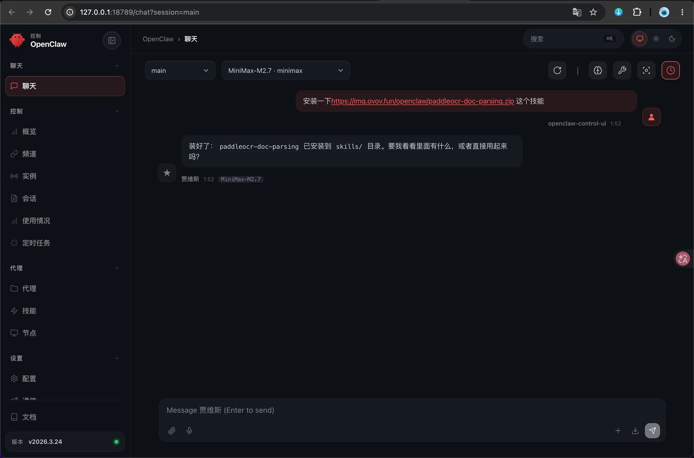
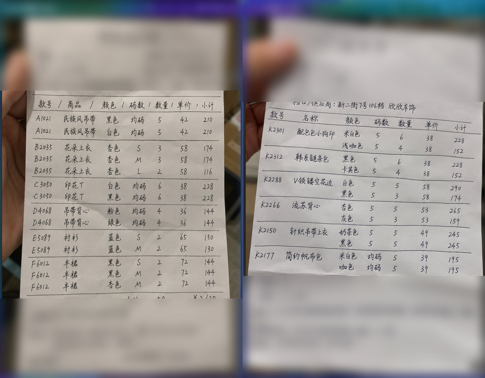
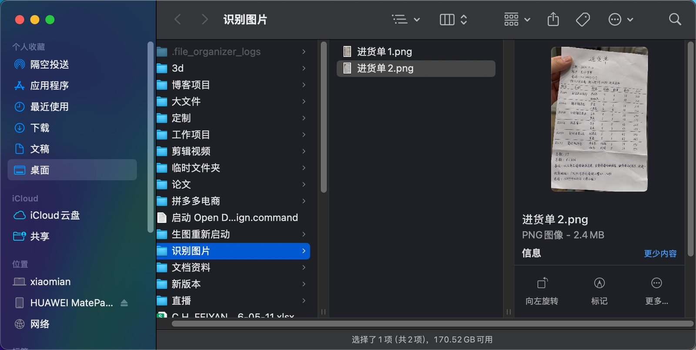
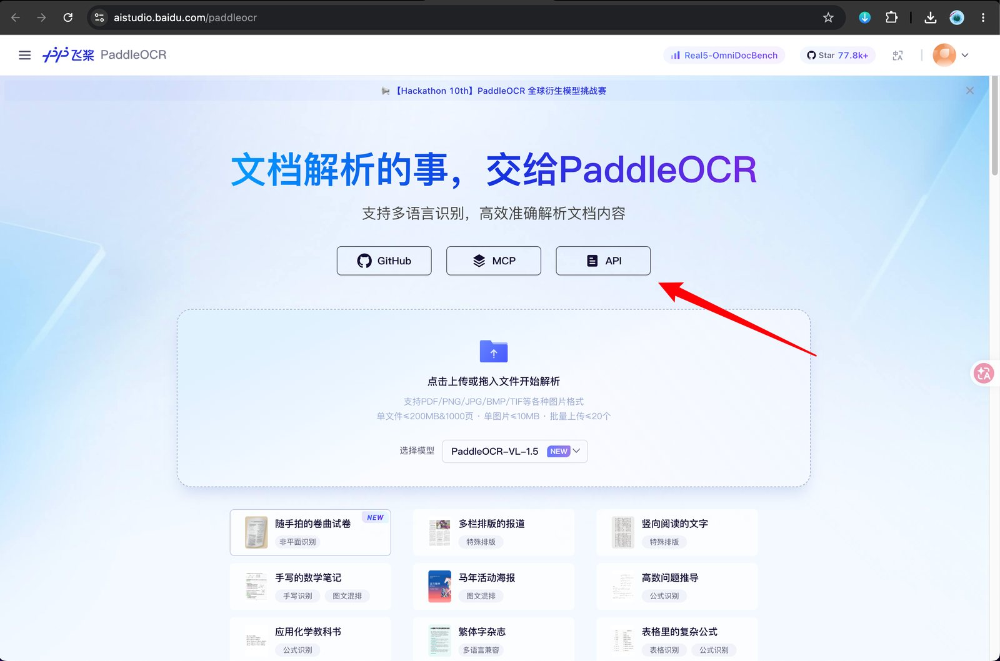
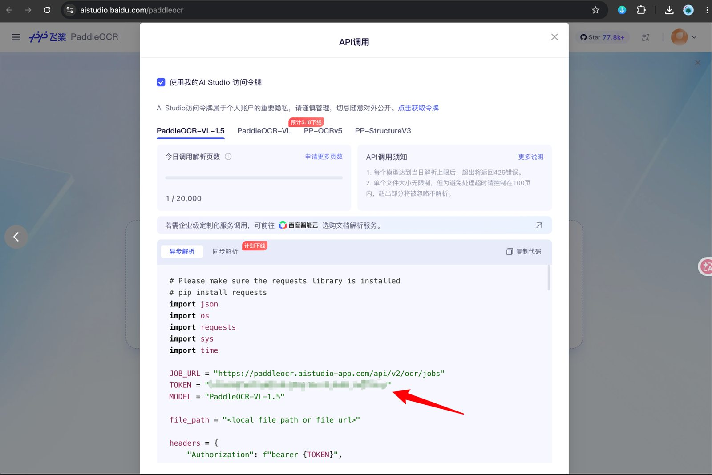
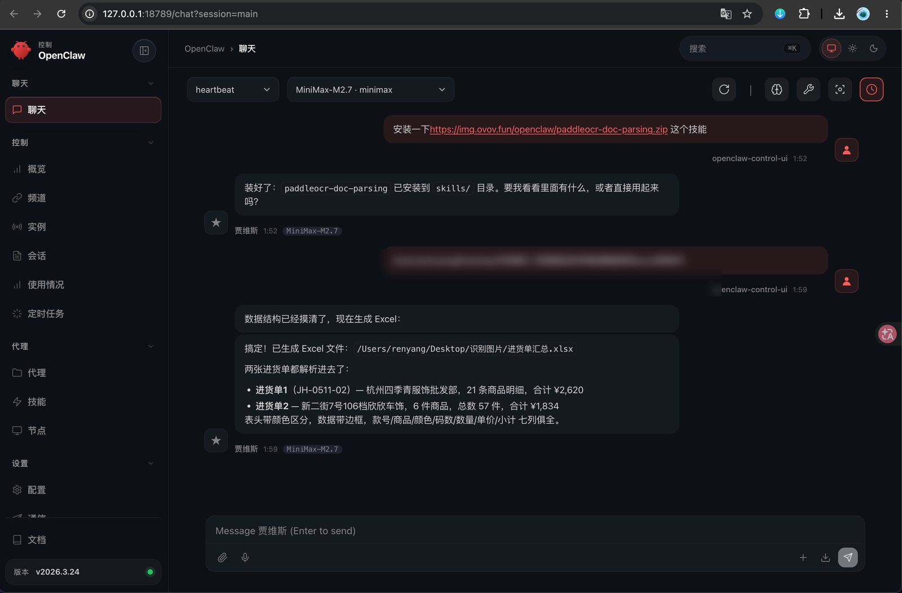
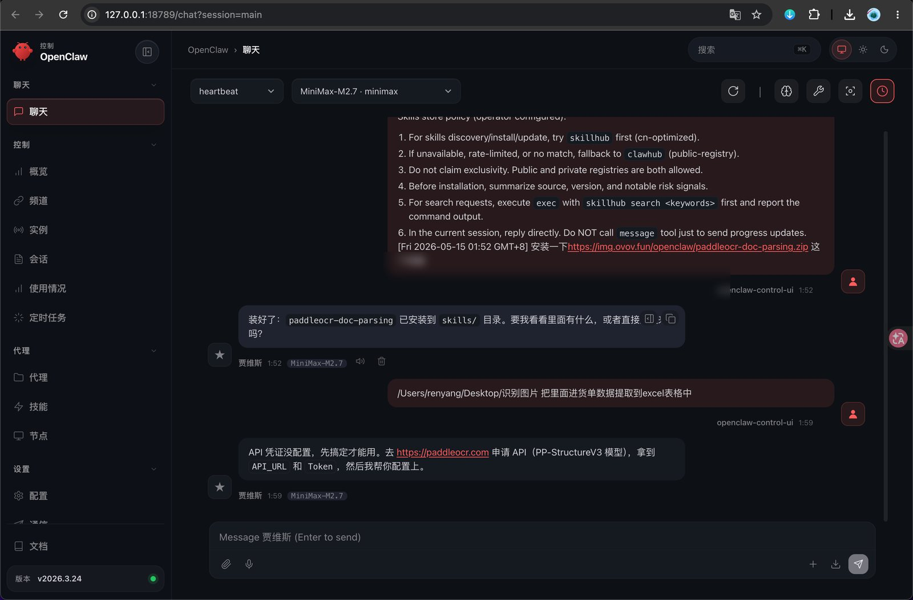

这篇教程演示如何在 OpenClaw 里安装并使用 `paddleocr-doc-parsing` 技能，把拍照得到的手写进货单识别成结构化数据，并生成 Excel 表格。

这个流程适合处理：

- 手写进货单、采购单、送货单。
- 手机拍照的纸质表格。
- 需要把款号、商品、颜色、码数、数量、单价、小计整理到 Excel 的场景。

> 说明：示例图片里包含客户、电话、地址等隐私信息，本文截图已经做了打码处理。你自己整理业务数据时，也建议先确认是否需要脱敏。

---

## 一、整体流程

这次的目标不是单纯识别图片里的文字，而是让 OpenClaw 完成完整的办公自动化流程：

1. 安装 `paddleocr-doc-parsing` 技能。
2. 准备要识别的进货单图片。
3. 配置 PaddleOCR API 凭证。
4. 让 OpenClaw 调用技能解析图片。
5. 把识别结果整理成 Excel 文件。

最后得到的结果是一个 `.xlsx` 表格，可以继续检查、修改、汇总。

---

## 二、安装 paddleocr-doc-parsing 技能

打开 OpenClaw，在聊天框里输入下面这句话：

```text
安装一下 https://img.ovov.fun/openclaw/paddleocr-doc-parsing.zip 这个技能
```

发送后等待 OpenClaw 自动下载、解压和安装。



看到类似下面的信息，就说明安装成功：

```text
装好了：paddleocr-doc-parsing 已安装到 skills/ 目录。
```

安装完成后，这个技能就可以在后续对话里直接使用。

---

## 三、准备进货单图片

这次示例准备了两张手写进货单图片，内容是服装进货明细，包括款号、商品、颜色、码数、数量、单价和小计。



图片不需要特别专业，但建议尽量满足下面几个条件：

- 表格主体完整，不要切掉边缘。
- 光线尽量均匀，避免强反光。
- 字迹尽量清楚，图片不要过度压缩。
- 多张单据最好放在同一个文件夹里，方便一次性处理。

示例中把两张图片放到了本地文件夹：

```text
/Users/renyang/Desktop/识别图片
```



你使用时，把路径换成自己的图片文件夹即可。

---

## 四、获取 PaddleOCR API 调用信息

如果第一次使用这个技能，OpenClaw 可能会提示 API 凭证还没有配置。因为 `paddleocr-doc-parsing` 需要调用 PaddleOCR 的文档解析接口，所以需要先准备 API 地址和访问令牌。

打开 PaddleOCR 页面，进入 API 调用入口。



在 API 调用窗口里，选择要使用的模型，并获取访问令牌。



示例里使用的是：

```text
MODEL = "PaddleOCR-VL-1.5"
```

你需要记录两项信息：

- `API_URL`
- `Token`

如果页面给出的是示例代码，就从示例代码里找到对应的 `JOB_URL` / `TOKEN` / `MODEL` 信息，再交给 OpenClaw 配置。

> 提醒：Token 属于个人账号凭证，不要截图公开，也不要发给不可信的人。

---

## 五、让 OpenClaw 识别图片并生成 Excel

API 凭证配置好以后，回到 OpenClaw，输入类似下面的需求：

```text
/Users/renyang/Desktop/识别图片 把里面进货单数据提取到 excel 表格中
```

这句话里最关键的是两个信息：

1. 图片所在的本地文件夹路径。
2. 目标结果是生成 Excel 表格。

OpenClaw 会读取文件夹中的图片，调用 `paddleocr-doc-parsing` 解析单据内容，然后把识别出来的数据整理成表格。



从示例结果可以看到，OpenClaw 已经完成了这些工作：

- 识别两张进货单。
- 清理表格结构。
- 合并到一个 Excel 文件。
- 保留颜色区分和明细字段。
- 输出生成后的 `.xlsx` 文件路径。

示例生成文件：

```text
进货单汇总.xlsx
```

---

## 六、常见问题：提示 API 没配置怎么办？

如果你直接让 OpenClaw 识别图片，但还没有配置 PaddleOCR API，可能会看到类似提示：

```text
API 凭证没配置，先搞定才能用。
```



这种情况不是技能安装失败，而是还缺少 PaddleOCR 的接口凭证。

处理方式：

1. 回到 PaddleOCR API 页面。
2. 获取 `API_URL` 和 `Token`。
3. 把凭证交给 OpenClaw 配置。
4. 再重新执行图片识别和 Excel 生成任务。

如果你更换了模型，也要确认 `MODEL` 名称和 API 页面里显示的一致。

---

## 七、适合怎么用

这个技能适合做“纸质单据 → 结构化表格”的第一步自动化。

比较适合：

- 小店进货单录入。
- 批发采购单整理。
- 手写表格转 Excel。
- 多张单据合并汇总。
- 后续再让 OpenClaw 做统计、对账或格式整理。

不建议直接把识别结果当成最终数据入账。更稳妥的做法是：

1. 先让 OpenClaw 生成 Excel。
2. 人工快速核对关键字段，例如数量、单价、小计。
3. 再用于库存、财务或对账。

---

## 八、可以直接复制的完整指令

第一次安装技能：

```text
安装一下 https://img.ovov.fun/openclaw/paddleocr-doc-parsing.zip 这个技能
```

识别本地图片并生成 Excel：

```text
/Users/renyang/Desktop/识别图片 把里面进货单数据提取到 excel 表格中
```

如果路径不同，把 `/Users/renyang/Desktop/识别图片` 改成你自己的图片文件夹路径即可。
